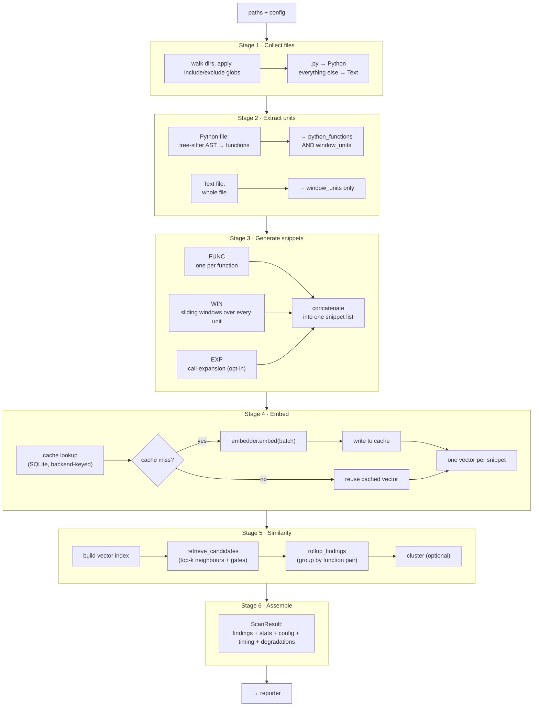

# 2 · The Detection Pipeline

This is the heart of the manual: how a directory of source code becomes a list of
findings. It is a single function, `run_pipeline` in
[`src/engines/pipeline.rs`](../src/engines/pipeline.rs), executing six stages in a
fixed order. Each stage is timed and its duration lands in the report.



## Stage 1 — Collect files

[`src/io/fs.rs`](../src/io/fs.rs) `collect_files` walks the given paths with
`walkdir`, prunes excluded directories early, applies the include/exclude
[glob layers](06-config-cli-and-reports.md#glob-selection), and de-duplicates by
canonical path. Each surviving file becomes a `FileRef` whose language is decided by
extension: `.py` → `Language::Python`, everything else → `Language::Text`. The file's
bytes are read once here and carried on the `FileRef` so no later stage touches the
disk again.

## Stage 2 — Extract units

The goal of this stage is to produce two lists: `python_functions` (for FUNC/EXP
snippets) and `window_units` (for WIN snippets).

- **Python files** are parsed by tree-sitter ([`src/parsing/python_ast.rs`](../src/parsing/python_ast.rs)
  `extract_functions`). It walks the concrete syntax tree, tracking a class/function
  name stack to build dotted qualified names (`Outer.method`), and handles `async
  def`, nested functions, and decorators. Each function goes into **both** lists.
  Parse errors never propagate — an unparseable file yields no functions and is
  logged, not fatal.
- **Every other file** becomes a single whole-file unit
  ([`src/parsing/text_units.rs`](../src/parsing/text_units.rs) `extract_file_unit`)
  and goes into `window_units` **only**.

This is why `stats.function_count` counts Python functions only, and why non-Python
duplication is detected purely through windows.

## Stage 3 — Generate snippets

[`src/snippets/`](../src/snippets/) turns units into the three snippet kinds, then
concatenates them into one flat list ([`generators.rs`](../src/snippets/generators.rs),
[`expansion.rs`](../src/snippets/expansion.rs)):

- **FUNC** — one snippet per Python function.
- **WIN** — slide a window of `window_lines` lines (default 40) with a stride of
  `stride_lines` (default 6) over each unit. A window is emitted only if it has at
  least `min_nonempty` (default 4) non-blank lines, which skips sparse/whitespace
  windows.
- **EXP** — only when `expansion.enabled` is set. Breadth-first inlines the bodies of
  called helpers into the caller (resolving local functions, `self`/`cls` methods,
  imports, and constructors), up to `depth` levels or `max_chars`. This surfaces
  clones that only match once you follow the calls. Off by default.

Every snippet's **analysis text** is comment-stripped here (that is what will be
embedded); its **display text** keeps comments. Each snippet also gets a
`snippet_hash` — a stable key used as its identity in the index and cache. (What that
key is built from matters for [self-match filtering](03-detection.md#the-two-gates).)

## Stage 4 — Embed

Each snippet's analysis text must become a vector. This stage is a cache in front of
a model ([`src/embedding/`](../src/embedding/) `embed_with_cache`):

1. Compute a cache key per snippet. The **backend name** is part of the key, so
   switching embedders never reuses another backend's vectors (exact format in
   [chapter 4](04-embeddings-and-backends.md#the-embedding-cache)).
2. Look the keys up in the SQLite cache in one batch.
3. Embed only the **misses**, in `batch_size` batches, through the chosen backend.
4. Write the new vectors back, and assemble the full list in the original order.

Which backend runs is chosen by config — `codebert` (default), `stub` (tests),
`onnx`, or `mlx`. They are interchangeable behind one trait; see
[Embeddings & backends](04-embeddings-and-backends.md). Any fallback the embedder or
cache performed (e.g. GPU→CPU) is drained here into the degradation list.

## Stage 5 — Similarity

This is where duplicates are actually found ([`src/similarity/`](../src/similarity/)).

1. **Build the index.** All embeddings go into a vector index keyed by
   `snippet_hash` ([`src/index/brute.rs`](../src/index/brute.rs) — brute-force cosine).
   The index is built **once** and shared read-only across worker threads.
2. **Retrieve candidates.** `retrieve_candidates` runs in parallel (rayon) over every
   snippet: query the index for the `top_k` (default 25) nearest neighbours, skip the
   snippet's own hash, then apply two gates — a **lexical floor** and a **per-kind
   composite threshold**. Survivors become `CandidateMatch`es.
3. **Roll up.** `rollup_findings` filters overlaps, applies the lexical gate a second
   time, de-duplicates, normalizes each pair's orientation, groups matches by function
   pair, and emits a `Finding` for each group that earns at least one reason.
4. **Cluster (optional).** If `--cluster` is set, findings are grouped into
   connected components of related functions and small clusters are dropped.

The exact scoring and gate arithmetic is the subject of the
[next chapter](03-detection.md).

## Stage 6 — Assemble

The findings, a `ScanStats` summary, a full config snapshot, the per-stage timings,
and the degradation list are packed into a `ScanResult`. Every degradation is also
logged to stderr so it is visible regardless of report format. The `ScanResult` is
then handed to the reporter chosen by `--format`.

## A worked trace

To make it concrete, follow one duplicate through the stages. Say `a.py` and `b.py`
each contain the same helper:

```python
def average(xs):
    return sum(xs) / len(xs)
```

1. **Collect** → two `FileRef`s, both `Language::Python`.
2. **Extract** → tree-sitter finds `average` in each; two `FunctionRef`s land in
   `python_functions` (and in `window_units`).
3. **Snippets** → a FUNC snippet per function (analysis text = the body, comments
   stripped). Each gets a distinct `snippet_hash` (the path and line span differ, so
   the hashes differ even though the text is identical).
4. **Embed** → each snippet's text becomes a vector. Same text → near-identical
   vectors, cosine ≈ 1.0.
5. **Similarity** → `a`'s snippet queries the index, finds `b`'s snippet as a
   neighbour (its own hash is skipped). Lexical overlap is high, composite clears the
   `func` threshold → one `CandidateMatch`. Rollup groups it under the
   `(a.py:average, b.py:average)` pair, earns the `func_threshold` reason, and emits a
   **Finding**.
6. **Assemble** → the finding, with its evidence and duplicated-line count, goes into
   the `ScanResult` and out to the report.

Rename `xs` to `values` in `b.py` and the story barely changes: the embedding is
still close (same meaning), lexical overlap dips but stays above the floor, and the
pair is still found — which is the whole point of blending the two signals.

## What determinism costs here

Two spots in this stage matter for the determinism invariant:

- The brute index sorts neighbours with a **stable** sort, so ties never reorder
  run-to-run.
- `retrieve_candidates` runs under rayon, which is unordered — so the *order* of
  findings can vary between runs, but the *set* of findings and their scores cannot.
  Any run-to-run comparison sorts findings first.

Next: [Detection internals](03-detection.md) — the exact scoring and rollup logic of
stage 5.
