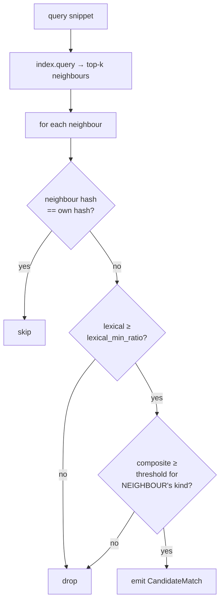
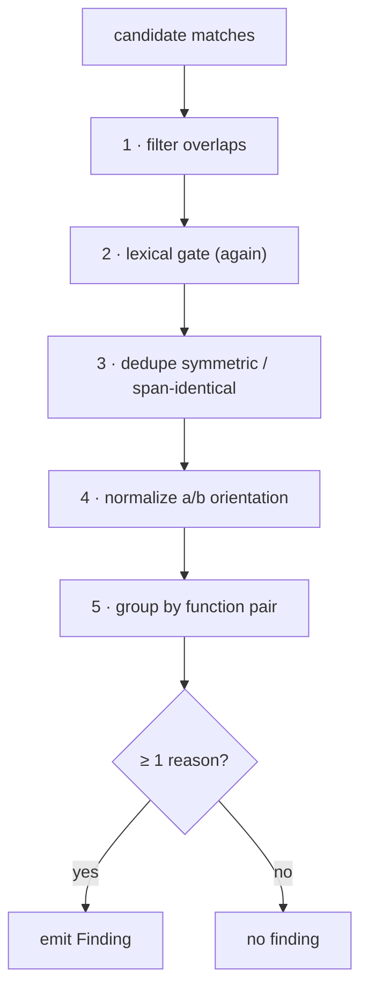

# 3 · Detection Internals

Stage 5 of the [pipeline](02-pipeline.md) is where snippet neighbours become
findings. This chapter is the precise logic: the score, the gates, and the rollup.
It lives in [`src/similarity/`](../src/similarity/).

## The composite score

Every candidate pair is scored by blending the two signals from
[Concepts](01-concepts.md):

```
composite = (1 − lexical_weight) · embedding_cosine  +  lexical_weight · lexical_jaccard
```

- `embedding_cosine` — cosine similarity of the two snippet vectors, returned by the
  index. Captures *meaning*.
- `lexical_jaccard` — Jaccard overlap of `[A-Za-z0-9_]+` tokens, lowercased
  ([`lexical.rs`](../src/similarity/lexical.rs)). Captures *surface overlap*.
- `lexical_weight` (default 0.3) — how much the lexical signal counts. At 0.0 the
  score is pure embedding; at 1.0 it is pure lexical.

## The two gates

A candidate must pass both gates to survive retrieval
([`candidates.rs`](../src/similarity/candidates.rs)):



1. **Lexical floor** — `lexical ≥ lexical_min_ratio` (default 0.5). This is the
   guard against the model's false positives; disjoint-token pairs are dropped even
   at cosine 1.0.
2. **Per-kind threshold** — `composite ≥` the threshold for the **neighbour's** kind:
   FUNC → `func` (default 0.92), WIN → `win` (0.90), EXP → `exp` (0.90). The threshold
   is chosen by the *neighbour* snippet's kind, not the query's.

The self-hash skip only stops a snippet from matching its own entry in the index. A
snippet's hash is built from its file path and line span (plus a code hash), **not**
from its text alone — so two *different* functions never collide on it, and a genuine
cross-file duplicate is reported normally.

## Rollup: candidates → findings

Many candidate matches can link the same two functions (several windows, plus the
FUNC pair). `rollup_findings` ([`rollup.rs`](../src/similarity/rollup.rs)) collapses
them into one finding, in this exact order:



1. **Filter overlaps.** A *self-clone* (same function on both sides) is kept only if
   the two line ranges are disjoint — an overlapping self-match is meaningless. Two
   *different* functions in the *same file* whose bodies overlap (e.g. a nested
   function inside its parent) are dropped as structural containment.
2. **Lexical gate, again.** The same `lexical_min_ratio` floor is re-applied here.
   It genuinely gates twice — once in retrieval, once in rollup.
3. **Dedupe.** Symmetric and span-identical matches collapse to one, keeping the
   highest similarity (ties broken by `kind_rank`).
4. **Normalize orientation.** Each pair is oriented into a canonical (A, B) order by
   comparing function identity strings, tie-broken by start line. This is the
   **single** place a/b orientation is decided — everything downstream relies on it.
5. **Group by function pair** and, for each group, compute the headline score
   (`best_score` = max composite in the group), the duplicated-line count, and the
   reasons.

### Reasons — why a finding is emitted

A group becomes a finding only if it earns **at least one reason**:

| Reason | Condition |
|--------|-----------|
| `func_threshold` | there is a FUNC-touching match whose best score ≥ `func` |
| `exp_threshold` | there is an EXP-touching match whose best score ≥ `exp` |
| `min_window_hits` | the **count** of WIN-touching matches ≥ `min_window_hits` |

Note the asymmetry: `min_window_hits` is a **count** gate, not a score gate. WIN
matches already passed the composite threshold during retrieval; the rollup only
asks whether there are *enough* of them. So a window pair can clear its threshold in
retrieval yet still fail to produce a finding if it is the only window and
`min_window_hits` is 2.

### Which evidence pair the report shows

A finding carries all its candidate matches, but the report highlights one
representative pair. `best_match` ([`ranking.rs`](../src/similarity/ranking.rs))
picks it with a deterministic 7-part rank key:

```
(kind_rank, min(len_a, len_b), similarity, −start_a, −end_a, −start_b, −end_b)
```

`kind_rank` prefers whole-function evidence (FUNC+FUNC = 3, FUNC+anything = 2, WIN+WIN
= 1, EXP paired with WIN or EXP = 0), then longer spans, then higher similarity, then
earlier position. The float similarity is compared via its bit pattern so the ordering is
total and identical on every run.

## Duplicated-line counting

The `duplicated_lines` on a finding answers "how much code is actually shared."

- **Cross-function** groups: merge each side's spans with adjacency (touching lines
  join), then take the smaller of the two covered totals.
- **Self-clone** groups: `SelfCloneOccurrences`
  ([`occurrences.rs`](../src/similarity/occurrences.rs)) builds a union-find over
  overlapping spans so an N-way chain of repeated blocks is counted once, not N
  times.

Both are order-independent — feed the same spans in any order, get the same count.

## Clone families

`build_groups` ([`clustering.rs`](../src/similarity/clustering.rs)) runs a union-find
over function identities: every finding links its two functions, and the connected
components are the clone families shown in JSON/HTML. This grouping is always on for
presentation and stats, but it never creates or removes a duplicate relationship.

## Where the knobs live

Every threshold in this chapter is a config field with a CLI override. Defaults are
in [`src/core/config.rs`](../src/core/config.rs); the layering rules are in
[Config, CLI & reports](06-config-cli-and-reports.md).

| Knob | Default | Effect |
|------|---------|--------|
| `lexical_weight` | 0.3 | lexical share of the composite score |
| `lexical_min_ratio` | 0.5 | the lexical floor gate (applied twice) |
| `threshold_func` | 0.92 | composite bar for FUNC neighbours |
| `threshold_win` | 0.90 | composite bar for WIN neighbours |
| `threshold_exp` | 0.90 | composite bar for EXP neighbours |
| `min_window_hits` | 1 | how many WIN matches a finding needs |
| `top_k` | 25 | neighbours retrieved per snippet |

Next: [Embeddings & backends](04-embeddings-and-backends.md) — how a snippet becomes
the vector this chapter compares.
