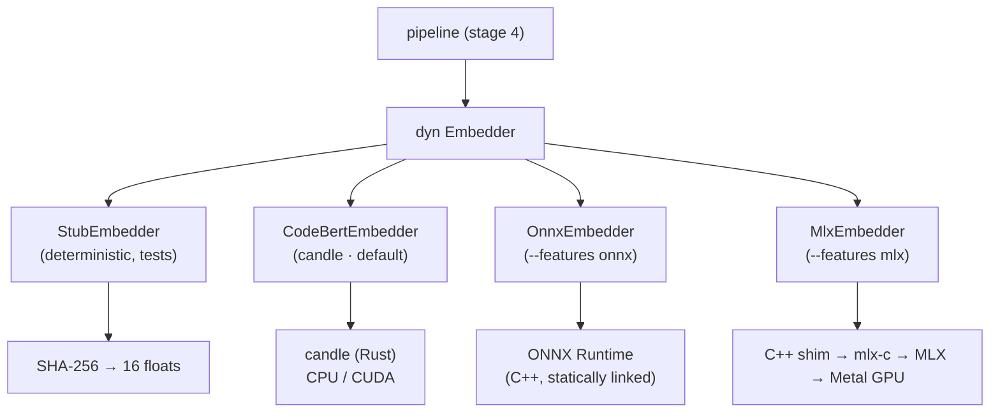
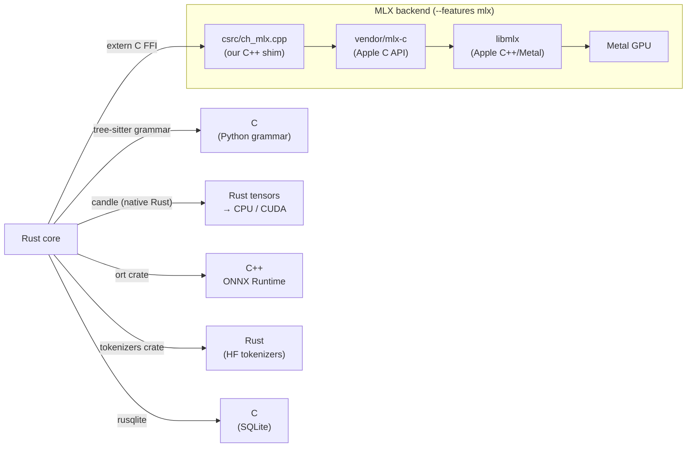

# 4 · Embeddings & Backends

[Stage 4](02-pipeline.md#stage-4--embed) turns each snippet's analysis text into a
768-float vector. This chapter covers how that happens, the four interchangeable
backends, the cache in front of them, and — because this is where CloneHunter crosses
language boundaries — the **Rust → C++ → C → Metal** handoff that the MLX backend
performs.

## One trait, four backends

All embedding backends implement a single trait
([`src/embedding/mod.rs`](../src/embedding/mod.rs)):

```rust
trait Embedder: Send {
    fn embed(&self, snippets: &[&SnippetRef]) -> Result<Vec<Embedding>, EmbeddingError>;
    fn take_degradations(&mut self) -> Vec<Degradation> { Vec::new() }
}
```

`create_embedder(config)` is the factory; the pipeline only ever holds a
`Box<dyn Embedder>` and never knows which concrete backend it has. This is what keeps
detection logic independent of the model — and lets the whole pipeline run in tests
with a fake embedder.



| Backend | Name | Build | Runtime | Notes |
|---------|------|-------|---------|-------|
| **CodeBERT / candle** | `codebert` | default | CPU everywhere; CUDA with `--features cuda`; Accelerate with `--features accelerate` | The reference backend. Single binary, works out of the box. |
| **Stub** | `stub` | always | CPU | Deterministic 16-dim hash embedding. No model download. Drives every integration test and the fast dev loop. |
| **ONNX Runtime** | `onnx` | `--features onnx` | CPU | Statically-linked ONNX Runtime, single binary. ~3× faster than candle-CPU. Needs a pre-exported `model.onnx`. |
| **Apple MLX** | `mlx` | `--features mlx` | Metal GPU | Fastest on Apple Silicon (~47s on the click benchmark). Not a single binary — ships a `libmlx.dylib` + `.metallib` sidecar. |

All real backends load the same `microsoft/codebert-base` weights (a RoBERTa-base
model), share the same bundled tokenizer, and mean-pool the model's last hidden state
with the attention mask. They differ only in the compute engine — and, because
floating-point math is not bit-identical across engines, their vectors differ
slightly, which is exactly why the cache key includes the backend name.

The shared tokenize → pad → flatten step lives in
[`src/embedding/shared.rs`](../src/embedding/shared.rs) (`tokenize_padded`), so all
three real backends feed the model byte-identical inputs.

## The embedding cache

Embedding is the slowest stage, so it sits behind a SQLite cache
([`src/embedding/cache.rs`](../src/embedding/cache.rs)). Its key is:

```
sha256("{backend}:{model}:{revision}:{max_tokens}:{snippet_hash}")
```

Because the key includes the backend, switching `--embedder` re-embeds on first use
rather than serving another engine's (slightly different) vectors. The cache is a
graceful-degradation citizen: on a schema-version mismatch or corruption it heals
itself (rebuilds), skips individual corrupt rows rather than failing, and records a
degradation. It uses WAL mode and chunked `IN` reads for throughput.

## Language handoffs

Most of CloneHunter is Rust, but embedding and parsing reach into other languages.
Here is every boundary the system crosses.



- **tree-sitter (C)** — Python parsing uses the tree-sitter runtime and the Python
  grammar, both C, called through Rust bindings. Handoff: Rust passes source bytes,
  gets back a syntax tree.
- **candle (Rust)** — the default backend needs no foreign language; candle is native
  Rust and dispatches to CPU or (optionally) CUDA kernels itself.
- **ONNX Runtime (C++)** — the `onnx` backend links ONNX Runtime statically via the
  `ort` crate. The C++ inference engine is compiled into the binary; no runtime dylib.
- **SQLite (C)** — the cache uses `rusqlite`, which bundles the SQLite C library.
- **HF tokenizers (Rust)** — tokenization uses the `tokenizers` crate (Rust) with a
  bundled `tokenizer.json`.

### The MLX handoff, in detail

The MLX backend is the one boundary CloneHunter *owns* rather than consumes, so it is
worth walking through. The chain is four layers deep:

1. **`MlxEmbedder` (Rust)** — [`src/embedding/mlx_backend.rs`](../src/embedding/mlx_backend.rs).
   A thin FFI wrapper. It tokenizes and pads (shared code), casts the token/mask
   buffers to `i32`, and calls the shim's C ABI (`ch_mlx_ctx_new`, `ch_mlx_embed`).
   It owns no model logic.
2. **`ch_mlx.cpp` (C++)** — [`csrc/ch_mlx.cpp`](../csrc/ch_mlx.cpp), exposing the tiny
   C header [`csrc/ch_mlx.h`](../csrc/ch_mlx.h). **This is where the entire RoBERTa
   forward pass + mean-pool lives**, written against Apple's `mlx-c` API: embeddings,
   12 transformer layers with fused scaled-dot-product attention, and pooling. It
   loads the weights once and picks a compute stream (Metal GPU if present, else CPU).
3. **`mlx-c` (C)** — [`vendor/mlx-c`](../vendor/mlx-c), Apple's official C API over
   MLX, vendored into the repo (see its `PROVENANCE.md` for the pinned version).
4. **`libmlx` (C++/Metal)** — Apple's MLX core, installed as a **prebuilt** library
   (via `scripts/setup-mlx.sh`), which dispatches to the Metal GPU.

The crate-root [`build.rs`](../build.rs) wires this together **only** under
`--features mlx`: it builds `mlx-c` against the prebuilt `libmlx` (never from source —
that would need Xcode's Metal toolchain), compiles our shim, and links them in the
right order (shim → `mlxc` → `mlx`). For every other build it is a no-op and the
`cc`/`cmake` build-dependencies are compiled out entirely.

Two design choices in the shim protect the invariants from the
[docs index](README.md#the-two-invariants-worth-knowing-up-front):

- **Non-fatal error handler.** MLX's default error handler calls `exit(-1)`, which
  would kill the whole scan on any op error. The shim replaces it, so an MLX failure
  surfaces as a normal `EmbeddingError` instead of a crash.
- **Metal→CPU degradation.** If no Metal GPU is available, the backend runs on CPU
  and records a `DeviceFallback` degradation rather than failing.

> **Why vendor `mlx-c` instead of a dependency?** It pins an exact, reviewed version
> of the C API next to the shim that targets it, keeps the build reproducible without
> a network fetch of Apple's toolchain, and removes the abandoned `mlx-rs`/`mlx-sys`
> crates from the tree. The provenance and bump procedure are documented in
> `vendor/mlx-c/PROVENANCE.md`.

## Choosing a backend

Practical guidance:

- **Just trying it / CI / tests** → `stub` (`CLONEHUNTER_EMBEDDER=stub`). Instant, no
  download, deterministic.
- **Default, portable** → `codebert`. Works on any platform; add `--features cuda` on
  a Linux NVIDIA box for the fastest option overall.
- **Apple Silicon, want speed** → `mlx`. Fastest on a Mac, at the cost of a sidecar.
- **Linux/CI wanting one static binary and better-than-candle CPU speed** → `onnx`.

The [README backend matrix](../README.md#embedding-backend-support-matrix) has the
measured timings.

> **`--device` has no `mps`.** It is `auto|cpu|cuda` only — candle's Metal path was
> removed. The Apple GPU is reached exclusively through the `mlx` backend, which
> selects Metal itself and ignores `--device`.

Next: [Code architecture](05-architecture.md) — where all of this lives in the tree.
