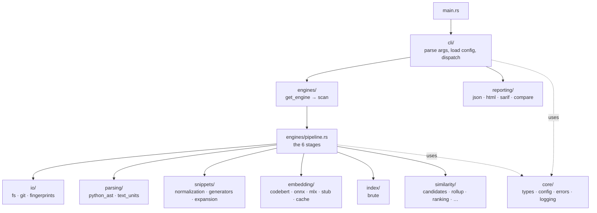
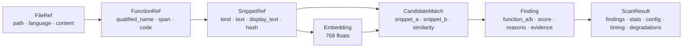
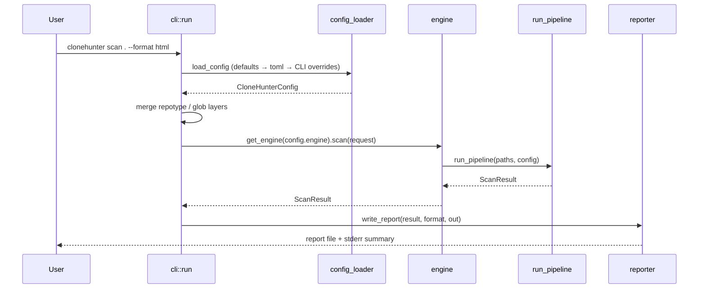

# 5 · Code Architecture

This chapter maps the code: the module layout, the core data types that flow between
modules, and the control path from `main` to a written report. If the earlier
chapters explained *what* happens, this one says *where* it lives.

CloneHunter is a single Rust crate. The binary is
[`src/main.rs`](../src/main.rs); the library is [`src/lib.rs`](../src/lib.rs).

## Module map

| Module | Responsibility |
|--------|---------------|
| [`core/`](../src/core/) | The spine: all data types (`types.rs`), config structs + defaults + presets (`config.rs`), config layering (`config_loader.rs`), errors, logging. |
| [`io/`](../src/io/) | File collection (`fs.rs`), git diff for `diff` (`git.rs`), hashing + cache keys (`fingerprints.rs`). |
| [`parsing/`](../src/parsing/) | Python → functions via tree-sitter (`python_ast.rs`); non-Python → whole-file unit (`text_units.rs`). |
| [`snippets/`](../src/snippets/) | Comment-strip normalization, FUNC/WIN generators, call-expansion. |
| [`embedding/`](../src/embedding/) | The `Embedder` trait, four backends, and the SQLite cache. See [chapter 4](04-embeddings-and-backends.md). |
| [`index/`](../src/index/) | The `VectorIndex` trait and the brute-force cosine implementation. |
| [`similarity/`](../src/similarity/) | The detection heart: candidates, lexical, scoring, ranking, rollup, occurrences, clustering. See [chapter 3](03-detection.md). |
| [`reporting/`](../src/reporting/) | HTML/JSON/SARIF writers + the shared `compare` selector. See [chapter 6](06-config-cli-and-reports.md). |
| [`engines/`](../src/engines/) | `pipeline.rs` (the semantic implementation), `semantic.rs` (delegate), `sonarqube.rs` (adapter), `get_engine`. |
| [`cli/`](../src/cli/) | clap-derive arg parsing, config resolution, glob merging, command dispatch. |

## The core data types

These live in [`src/core/types.rs`](../src/core/types.rs) and are the vocabulary that
flows through the pipeline. Each stage transforms one into the next.

- **`FileRef`** — a collected file: path, language, content hash, and the file bytes
  (carried so parsing never re-reads disk; excluded from serialization).
- **`FunctionRef`** — a unit of code. `identity()` = `"{path}:{qname}:{start}:{end}"`
  is the stable key used for grouping and clustering.
- **`SnippetRef`** — the embedding/matching unit: `kind` (Func/Win/Exp), analysis
  `text`, `display_text`, and `snippet_hash` (its index/cache identity).
- **`Embedding`** — a vector of `f32`.
- **`CandidateMatch`** — a surviving pair with its composite `similarity` and an
  evidence string.
- **`Finding`** — the rolled-up result for a function pair.
- **`ScanResult`** — everything a reporter needs. The single value handed from engine
  to reporter.

## Control flow, end to end

`run()` in [`src/cli/mod.rs`](../src/cli/mod.rs) is the entry point. It parses args,
resolves and layers config, calls the engine, and dispatches the `ScanResult` to the
reporter chosen by `--format`. The `diff` command wraps the same path: it computes
the changed files via git, runs a full scan, and filters findings down to those
touching a changed file.

## The engine indirection

`get_engine` ([`src/engines/mod.rs`](../src/engines/mod.rs)) returns one of two
engines behind a trait:

- **`semantic`** — the real pipeline, a one-line delegate to `run_pipeline`.
- **`sonarqube`** — an adapter that ignores the scan entirely and instead reads a
  SonarQube duplication report from the `CLONEHUNTER_SONAR_REPORT` env var, mapping
  its entries into `Finding`s. It runs no embedding or indexing; scan paths and tuning
  flags have no effect (and it warns to say so).

This is the seam that would let a future detection strategy slot in without touching
the CLI or the reporters.

## Testing seam

The whole pipeline is testable without downloading a model: `CLONEHUNTER_EMBEDDER=stub`
(or config) swaps in the deterministic `StubEmbedder`, so every integration test
exercises real collection, parsing, snippet generation, indexing, scoring, and rollup
— just with a fake, reproducible embedder. This is a direct consequence of the
`Embedder` trait indirection from [chapter 4](04-embeddings-and-backends.md).

Next: [Config, CLI & reports](06-config-cli-and-reports.md) — the input and output
edges of the system.
