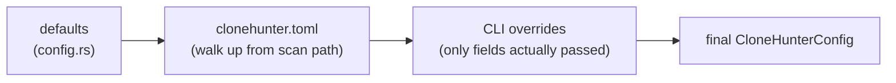
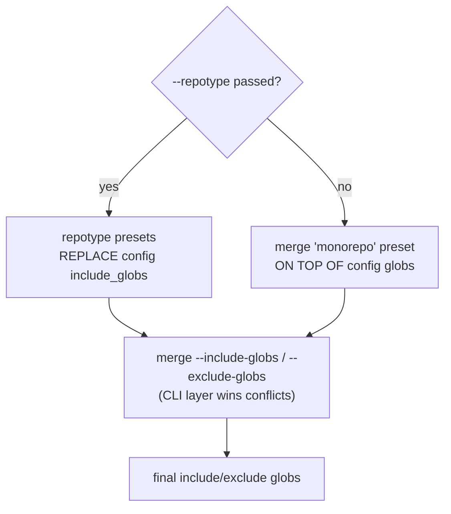
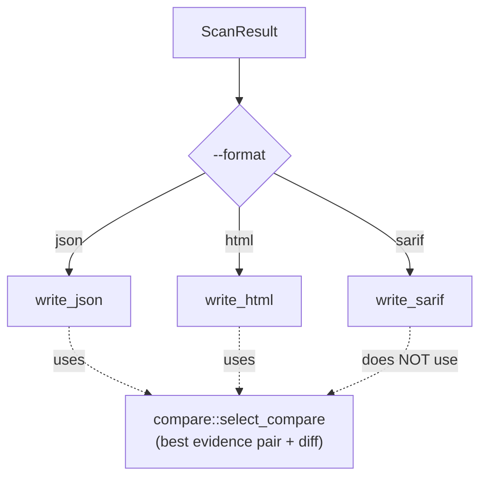

# 6 · Config, CLI & Reports

The two edges of the system: how a run is *configured* (defaults, file, flags, globs)
and how results are *rendered* (HTML, JSON, SARIF). Both are thin shells around the
pipeline — the interesting logic is the layering on the way in and the shared
evidence selection on the way out.

## The two commands

The CLI ([`src/cli/mod.rs`](../src/cli/mod.rs), clap-derive) has two subcommands that
share a common set of flags (paths, `--format`, `--out`, `--engine`, `--embedder`,
`--index`, `--device`):

- **`scan [PATHS…]`** carries the full tuning surface — thresholds, windows,
  expansion, cache path, and glob/repotype selection.
- **`diff --base REF`** carries only the common flags plus `--base`. It scans, then
  keeps only findings touching a git-changed file.

The full flag list is in the [README](../README.md#cli-options-selected). Every
override is an `Option<T>` so that an unset flag never clobbers a config value.

> **`--index faiss` is accepted but not implemented.** It is present for CLI
> compatibility and falls back to the brute-force index, recording a degradation
> (logged to stderr and shown in the report) rather than failing silently. See
> [chapter 5](05-architecture.md#module-map), `index/`. The only real index is
> `brute`.

## Config layering

Configuration is resolved in [`src/core/config_loader.rs`](../src/core/config_loader.rs)
as three layers, each overriding the previous:

1. **Defaults** — the `Default` impls in [`src/core/config.rs`](../src/core/config.rs)
   (thresholds 0.92/0.90/0.90, windows 40/6/4, `top_k` 25, codebert, etc.).
2. **`clonehunter.toml`** — discovered by walking *up* from the scan path (so a scan
   of a subdirectory still finds the repo-root config). Both `scan` and `diff` do this
   walk-up.
3. **CLI overrides** — merged last. Each override sub-struct is only constructed when
   the user actually touched a flag in that group, so partial overrides are safe.

`validate_config` then checks enum membership and that ratios sit in `[0, 1]`.

> **Config safety invariant.** Overrides are strictly additive: an unset CLI flag is
> `None` and dropped. This is deliberate — it is the one rule that keeps a stray flag
> from silently resetting a carefully tuned `clonehunter.toml`.

## Glob selection

Which files get scanned is decided by include/exclude globs, layered separately from
the config above (in [`src/cli/glob_merge.rs`](../src/cli/glob_merge.rs), `scan` only):

- **`--repotype <lang>…`** selects language presets (repeatable, e.g. `--repotype
  python --repotype react`). When passed explicitly, the preset **replaces** the
  config's includes.
- **No `--repotype`** → the `monorepo` preset (all supported languages) is merged on
  top of the config globs.
- **`--repotype none`** → empty includes → zero files (unless `--include-globs` adds
  some back).
- **`--include-globs` / `--exclude-globs`** are the final CLI layer; when the same
  pattern appears on both sides, the CLI layer wins.

## `scan` vs `diff`: a real gotcha

`diff` and `scan` do **not** scan the same file set. `diff` skips the
repotype/monorepo glob merging entirely, so it obeys only the config's default
`**/*.py` include — whereas a bare `scan` picks up all languages via the `monorepo`
default. Cross-language `diff` therefore needs an explicit `clonehunter.toml` include
list. (`diff` *does* discover that config via the same walk-up as `scan`.)

## Reports: one result, three renderings

All three formats consume the **same** `ScanResult`, so they never disagree on *what*
was found or *where* — a finding's functions, spans, and score are identical across
formats. `write_report` ([`src/cli/mod.rs`](../src/cli/mod.rs)) dispatches by
`--format`:

- **JSON** ([`json.rs`](../src/reporting/json.rs)) — the richest. Findings are nested
  under a top-level **`groups`** array (there is no flat `findings` array): each group
  carries its unique member `locations`, `max_score`/`max_duplicated_lines`, and its
  pairwise `findings` (both functions, the best-match `compare` block — kind, span,
  similarity, unified diff — duplicated-line count, reasons). A 2-location clone is a
  group with 2 locations and 1 finding; findings sharing a function merge into one
  N-location group. Plus top-level `stats` (now including `group_count` and the
  de-duplicated `grouped_function_count`), `config`, `timing`, and `degradations`.
  Schema-locked by golden snapshot tests. Groups are derived at serialization time by
  `similarity::build_groups` and are stable/re-numbered — detection output is unchanged.
- **HTML** ([`html.rs`](../src/reporting/html.rs)) — the same findings rendered for a
  human: self-contained page (inline CSS/JS), side-by-side diff, self-clone-aware
  display, client-side sorting, and a degradation banner. It always renders clone-family
  cards: single-finding families open directly as pair diffs, while larger families
  collapse behind an outer card that lists the member locations and renders every finding
  as an equal side-by-side diff (self-clones labeled as internal duplication).
- **SARIF** ([`sarif.rs`](../src/reporting/sarif.rs)) — a lean SARIF 2.1.0 document of
  `note`-level results with rule id, message, and physical location per finding. For
  code-scanning integrations (e.g. GitHub Code Scanning); it deliberately carries **no
  diff**. Also schema-locked by golden snapshots.

JSON and HTML share the evidence-selection logic: `compare::select_compare`
([`compare.rs`](../src/reporting/compare.rs)) uses `best_match` (from
[chapter 3](03-detection.md#which-evidence-pair-the-report-shows)) to pick the one
representative pair and hand it to both. SARIF only needs locations, so it skips that
path. The result: JSON = full evidence, HTML = that evidence made visual, SARIF = the
location/severity subset — same source of truth, three depths of detail.

## Where things get written

Default output is `clonehunter_report.<ext>` in the working directory; `--out`
overrides it. The chosen path and finding count are echoed to stderr at the end of a
run. Example reports live in [`examples/`](../examples/).

That completes the tour. Back to the [manual index](README.md) for the full map, or
jump to any chapter you need.
