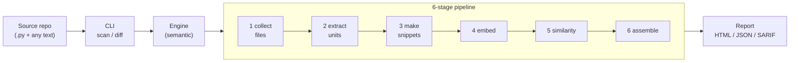

# CloneHunter — Architecture Manual

This folder explains **how CloneHunter works** and **how it is built** — the moving
parts, the flow of data, and the boundaries where one language hands off to another.

CloneHunter finds duplicate code across a mixed-language repository. It is not a
grep or a token-diff tool: it *reads* code the way a model does — turning each
snippet into a vector, finding the nearest neighbours, and blending that semantic
signal with a plain lexical overlap score before deciding what counts as a clone.

## The system in one picture

Everything CloneHunter does is that pipeline. The CLI chooses *what* to scan and
*how* to tune it; the engine runs the six stages; the reporter renders the result.

## How to read this manual

Start at the top and stop when you know enough. Each doc is self-contained.

| # | Doc | Read it to understand… |
|---|-----|------------------------|
| 1 | [Concepts & glossary](01-concepts.md) | What a "clone" means here, and the vocabulary (snippet, FUNC/WIN/EXP, composite score) used everywhere else. Start here if you're new. |
| 2 | [The detection pipeline](02-pipeline.md) | The end-to-end flow: how source files become findings, stage by stage. **The core of the system.** |
| 3 | [Detection internals](03-detection.md) | How a candidate becomes a finding: composite scoring, the two retrieval gates (lexical floor + per-kind threshold), rollup, self-clones, clustering. |
| 4 | [Embeddings & backends](04-embeddings-and-backends.md) | How code becomes a vector, the four interchangeable backends, the embedding cache, and the **Rust → C++ → C → Metal language handoffs**. |
| 5 | [Code architecture](05-architecture.md) | The module map, the core data types, and the control flow from `main` to the reporter. |
| 6 | [Config, CLI & reports](06-config-cli-and-reports.md) | How configuration is layered, the CLI surface, glob/repotype selection, `scan` vs `diff`, and the three report formats. |

## The two invariants worth knowing up front

Two properties shape almost every design decision in the codebase:

- **Determinism.** The same inputs always produce the same set of findings, with
  the same scores. Sorts are stable, tie-breaks are explicit, and the test-only
  `stub` embedder is fully deterministic. Detection output is pinned by a checked-in
  regression fixture (`benchmark/baseline.json`) that records the expected findings and
  scores, so any change that moves a score is caught and must be intentional.

- **Graceful degradation.** Nothing aborts the scan if it can be worked around. A
  GPU that isn't there falls back to CPU; a corrupt cache heals itself; an
  unparseable file is skipped. Every such event is recorded as a *degradation* and
  surfaced in the report, so a fallback is visible rather than silent.

Keep these two in mind and the rest of the design reads naturally.
